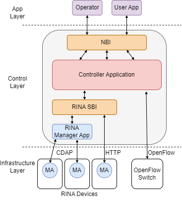

# Short description
RINA Southbound Driver is a python-based library to enable SDN controllers manage RINA-based devices. 

# Pre-requisites
<ul>
    <li> Python 3.6 or higher.</li> 
    <li> RINA implementation for OS/Linux [IRATI open source](https://https://github.com/IRATI/stack).</li> 
</ul>

# Installation
# Build
# Architecture

